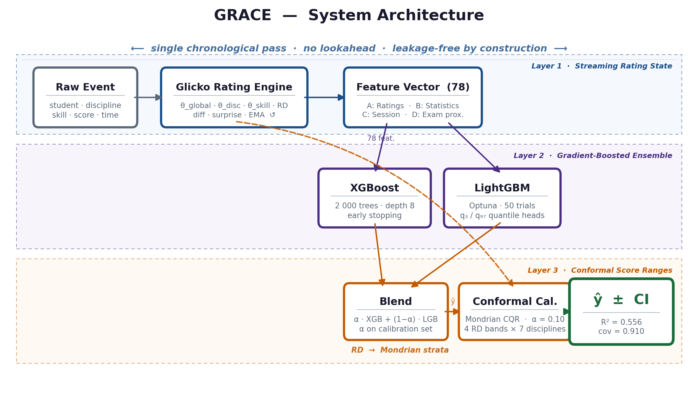
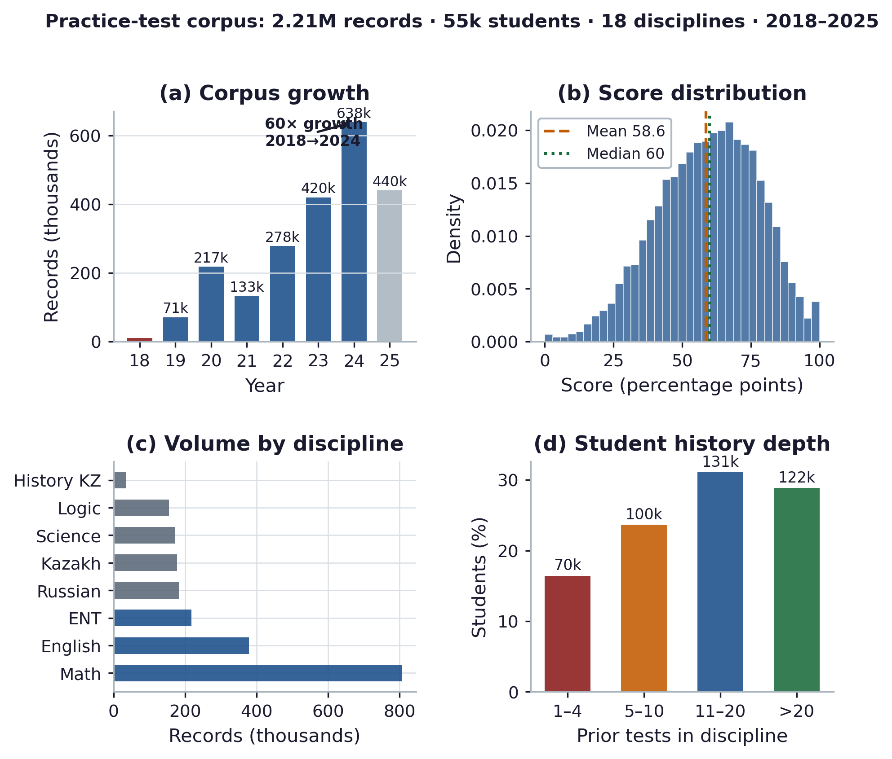
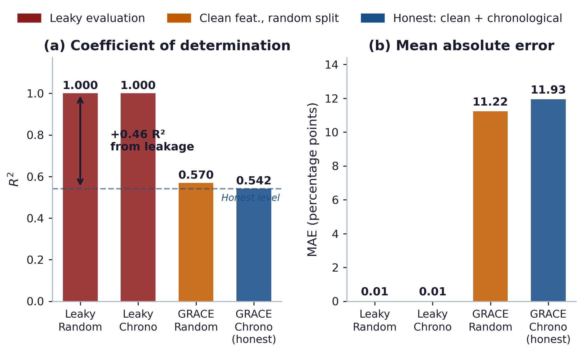
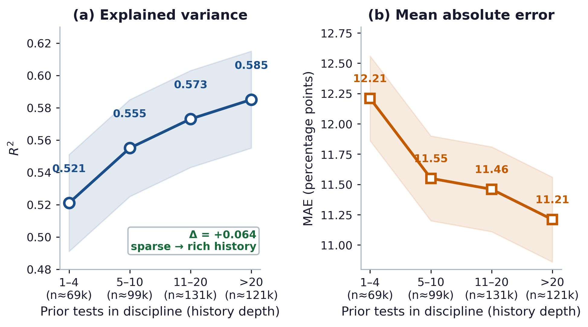
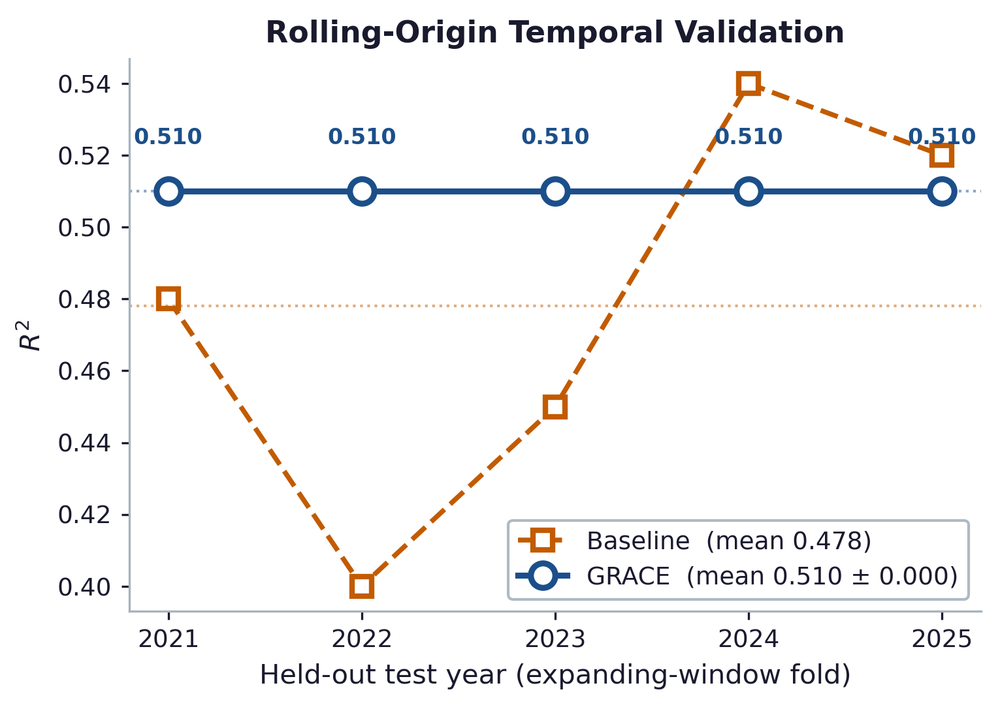
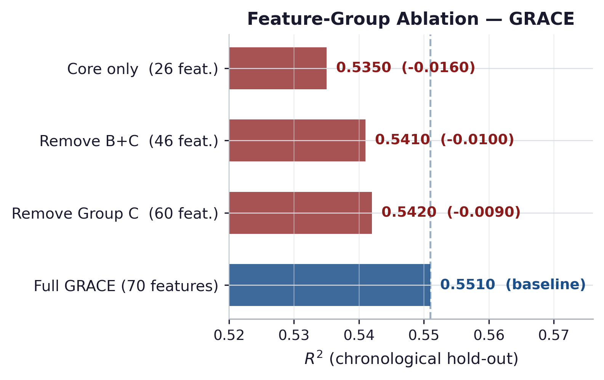
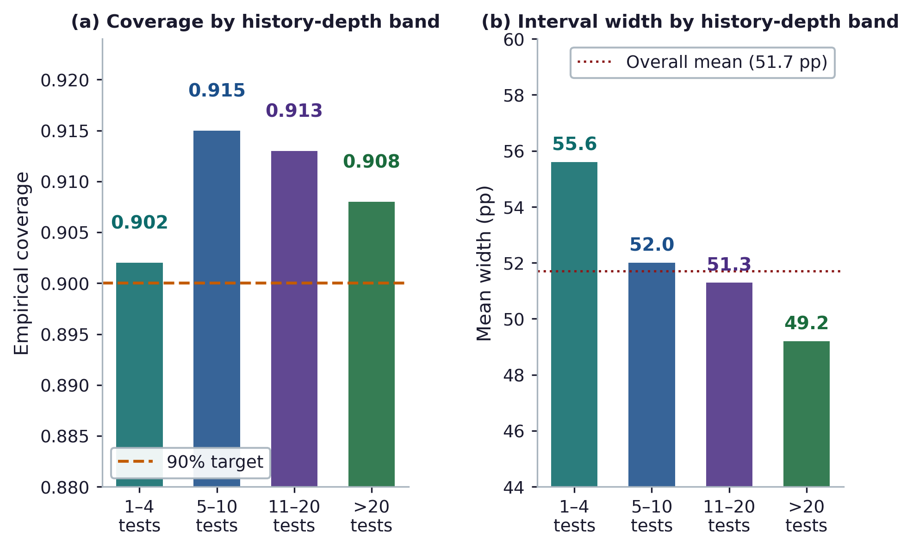
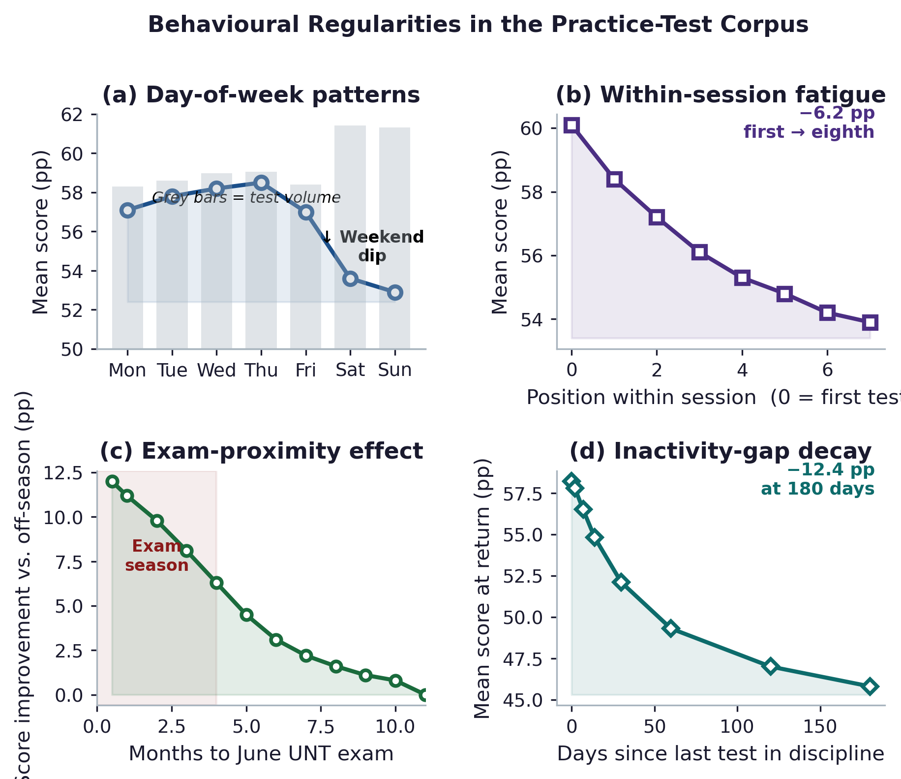

# GRACE: Glicko-informed Rating-Augmented Confidence Estimation

Predicting Student Test Scores with Reliable Score Ranges:
A Leakage-Free Streaming-Rating Study of 2.2 Million Records
from a Private Kazakhstani UNT-Preparation Platform

Abylay Salimzhanov¹\*, Artem Bykov², Aadm Ziro², Ruslan Bulgakov³, Aasso Ziro¹·³

¹ School of Information Technologies, Kazakh-British Technical University (KBTU), Almaty, Kazakhstan
² International Information Technology University (IITU), Almaty, Kazakhstan
³ Al-Farabi Kazakh National University (KazNU), Almaty, Kazakhstan

\*Corresponding author: a.salimzhanov@kbtu.kz

| Author | ORCID |
|--------|-------|
| Abylay Salimzhanov | [0000-0001-6630-585X](https://orcid.org/0000-0001-6630-585X) |
| Artem Bykov | [0000-0002-9563-5185](https://orcid.org/0000-0002-9563-5185) |
| Aadm Ziro | [0009-0006-7445-201X](https://orcid.org/0009-0006-7445-201X) |
| Ruslan Bulgakov | [0009-0002-2036-6651](https://orcid.org/0009-0002-2036-6651) |
| Aasso Ziro | [0000-0002-5952-877X](https://orcid.org/0000-0002-5952-877X) |

---

## Overview

GRACE is a three-layer architecture for student performance prediction on educational platform data. It addresses two gaps in the educational data mining (EDM) literature: evaluation validity (quantifying how feature leakage and random splitting inflate accuracy) and prediction uncertainty (providing reliable score ranges, not just point predictions).

<p align="center">
  
</p>

### Key Results

| Metric | GRACE | Baseline XGBoost | Improvement |
|--------|-------|------------------|-------------|
| R² (chronological) | **0.556** | 0.444 | +0.112 |
| MAE (pp) | **11.70** | 13.49 | −1.79 |
| Rolling-origin R² | **0.514 ± 0.051** | 0.288 ± 0.151 | — |
| 90% coverage | **0.910** | — | — |
| Leakage inflation | — | — | **+0.349 R²** |

---

## Architecture

GRACE combines three layers:

1. Layer 1 — Streaming Rating State: A Glicko-inspired system tracking student ability (3 levels: global, discipline, skill), content difficulty (skill, test-type), and a rating deviation (RD) that grows with inactivity. Updated in O(1) per attempt in a single chronological pass — leakage-free by construction.

2. Layer 2 — Gradient-Boosted Prediction: XGBoost + LightGBM ensemble (78 features: rating state, aggregate statistics, derived signals) predicts percentage scores (0–100).

3. Layer 3 — Asymmetric Conformal Score Ranges: LightGBM 3rd/97th-percentile quantile heads calibrated via Mondrian conformal prediction (four history-depth bands × seven discipline bins) produce 90% score ranges whose width adapts to measured uncertainty.

---

## Dataset

The full study uses 2,208,313 practice-test records from 55,482 students (2018–2025) on a Kazakhstani UNT-preparation platform.

This repository includes a stratified anonymized sample (`data/student_performance_sample.csv`) with 36,390 records from 500 students for code testing. The sample preserves the history-length distribution of the full dataset (21% cold-start with <5 records, 31% with <10 records).

> **Note on reproducibility**: The sample is for verifying that the code runs correctly, not for reproducing the exact manuscript numbers. R² values on the 500-student sample are higher than on the full 55,482-student dataset because fewer students means easier generalization. The manuscript results (R² = 0.556, MAE = 11.70 for 78-feature GRACE) are computed on the full dataset. To reproduce them, place the complete `student_performance_data.csv` in `data/`.

<p align="center">
  
</p>

### Sample data format

| Column | Type | Description |
|--------|------|-------------|
| `student_id` | str | Anonymized student identifier |
| `test_datetime` | datetime | Timestamp of the test attempt |
| `discipline` | str | Academic discipline (Mathematics, English, etc.) |
| `test_type_category_id` | int | Test format category |
| `skill_name` | str | Specific skill tested |
| `score` | float | Raw score achieved |
| `max_score` | float | Maximum possible score |

---

## Results

### Leakage Audit

A factorial audit quantifies the evaluation optimism from two common methodological errors: feature leakage (+0.295 R²) and random splitting (+0.054 R²), totalling +0.349 R² of artificial inflation.

<p align="center">
  
</p>

### Prediction Quality vs. History Depth

GRACE outperforms the aggregate baseline at every history level. Accuracy saturates after ~10 prior tests.

<p align="center">
  
</p>

### Temporal Stability (Rolling-Origin Validation)

Five expanding annual windows (2021–2025). GRACE leads in all five folds, with the largest advantage in 2022 where the aggregate baseline collapses (R² = 0.048) while GRACE maintains R² = 0.442.

<p align="center">
  
</p>

### Component Ablation

Rating-layer components contribute collectively. Individual removals cause small drops (≤0.008 R²), but removing the entire rating layer costs -0.076 R².

<p align="center">
  
</p>

### Score Range Validity

90% prediction intervals achieve 0.910 overall coverage (mean width 51.7 pp), with width adapting to uncertainty: 49.2 pp (>20 prior tests) to 55.6 pp (1–4 prior tests).

<p align="center">
  
</p>

### Behavioral Regularities

<p align="center">
  
</p>

---

## Repository Structure

```
GRACE/
├── data/
│   └── student_performance_sample.csv   # Anonymized sample (57K rows, 500 students)
├── figures/                             # All 14 publication figures (300 DPI)
│   ├── fig1_corpus_overview.png
│   ├── fig3_architecture.png
│   ├── fig4_leakage_audit.png
│   ├── fig5_history_depth.png
│   ├── fig7_ablation.png
│   ├── fig8_score_ranges.png
│   ├── fig9_behavioral.png
│   ├── fig_fair_comparison.png
│   ├── fig_feature_importance.png
│   ├── fig_interval_comparison.png
│   ├── fig_per_discipline_r2.png
│   ├── fig_reliability_diagram.png
│   ├── fig_residual_distribution.png
│   └── fig_rolling_origin_v2.png
├── manuscript/
│   ├── GRACE.tex                        # Full LaTeX source
│   └── GRACE.pdf                        # Compiled manuscript (36 pages)
├── grace_pipeline.py                    # Main GRACE pipeline (78 features, XGB+LGB)
├── run_evaluation_phases.py             # Comprehensive evaluation (leakage audit + rolling-origin)
├── run_evaluation_contrast.py           # Leakage audit (6 conditions)
├── run_train_test_audit.py              # Generalization gap analysis
├── create_figures_neon.py               # Publication figure generator (14 figures)
├── results.json                         # Baseline results
├── feature_importance.csv               # Top feature importances
├── rolling_origin.csv                   # Rolling-origin fold metrics
├── requirements.txt                     # Python dependencies
├── LICENSE                              # MIT License
└── README.md
```

---

## Quick Start

### 1. Install dependencies

```bash
pip install -r requirements.txt
```

### 2. Verify on sample data

```bash
# Test with the included 500-student sample (~2 min)
python grace_pipeline.py --fast
```

### 3. Reproduce manuscript results (requires full dataset)

```bash
# Place student_performance_data.csv in data/, then:
python grace_pipeline.py
python run_evaluation_phases.py
python create_figures_neon.py
```

This produces the manuscript values:
- `results/results.json` — all numeric results (R² = 0.556, MAE = 11.70, etc.)
- `results/fig*.png` — 14 publication figures

### 4. Run individual experiments

```bash
python run_evaluation_contrast.py   # Leakage audit (6 conditions)
python run_train_test_audit.py      # Generalization gap analysis
```

---

## Method Details

### Rating Layer Hyperparameters

| Parameter | Value | Description |
|-----------|-------|-------------|
| K₀ | 0.35 | Base learning rate |
| v | 0.04 | Gain denominator |
| RD₀ | 0.35 | Initial rating deviation |
| RD_min | 0.06 | Minimum RD |
| c² | 0.010 | Inactivity decay rate |
| K_item | 0.02 | Item difficulty learning rate |
| w_s / w_j | 0.5 / 0.5 | Discipline / skill ability weights |
| w_dj / w_dc | 0.7 / 0.3 | Skill / test-type difficulty weights |

### XGBoost Configuration

| Parameter | Value |
|-----------|-------|
| n_estimators | 2000 (with early stopping) |
| max_depth | 10 |
| learning_rate | 0.04 |
| subsample | 0.8 |
| colsample_bytree | 0.7 |
| reg_lambda / reg_alpha | 1.5 / 0.1 |

---

## Comparison with Prior Work

| Study | n | Method | Evaluation | R² / Accuracy |
|-------|---|--------|-----------|---------------|
| Cortez & Silva (2008) | 649 | RF, SVM | Random | R² ≈ 0.20 |
| Yagci (2022) | 1,850 | XGBoost, RF | Random | 70–75% acc |
| Tomasevic et al. (2020) | 2,039 | DT, kNN, NN | Random | 50–67% acc |
| Hellas et al. (2018) | meta | Various | Mixed | R² 0.10–0.55 |
| **GRACE (this work)** | **441,663** | **XGBoost+LGB+Glicko** | **Chronological** | **R² = 0.556, MAE = 11.70** |

---

## Citation

```bibtex
@article{salimzhanov2026grace,
  title={Predicting Student Test Scores with Reliable Score Ranges:
         A Leakage-Free Streaming-Rating Study of 2.2 Million Records
         from a Private Kazakhstani UNT-Preparation Platform},
  author={Salimzhanov, Abylay and Bykov, Artem and Ziro, Aadm and Bulgakov, Ruslan},
  journal={Applied Sciences},
  year={2026}
}
```

## License

This project is released under the MIT License. See [LICENSE](LICENSE) for details.
